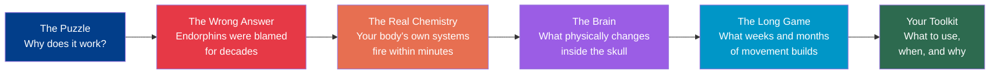
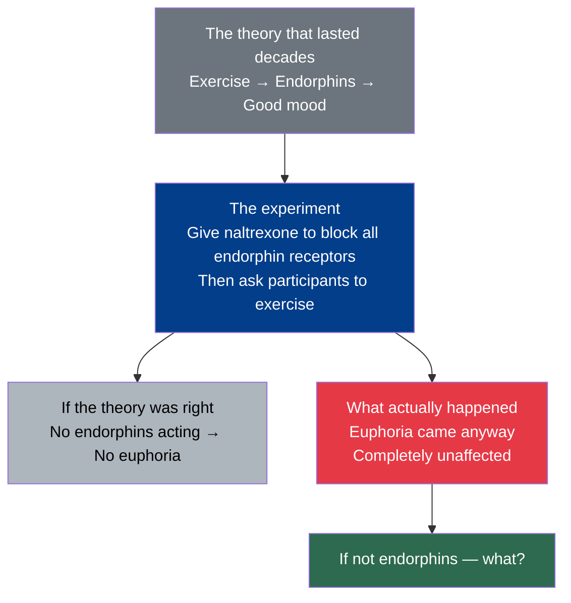
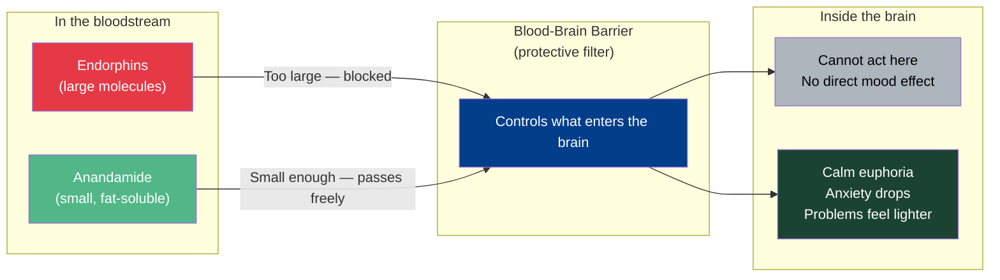
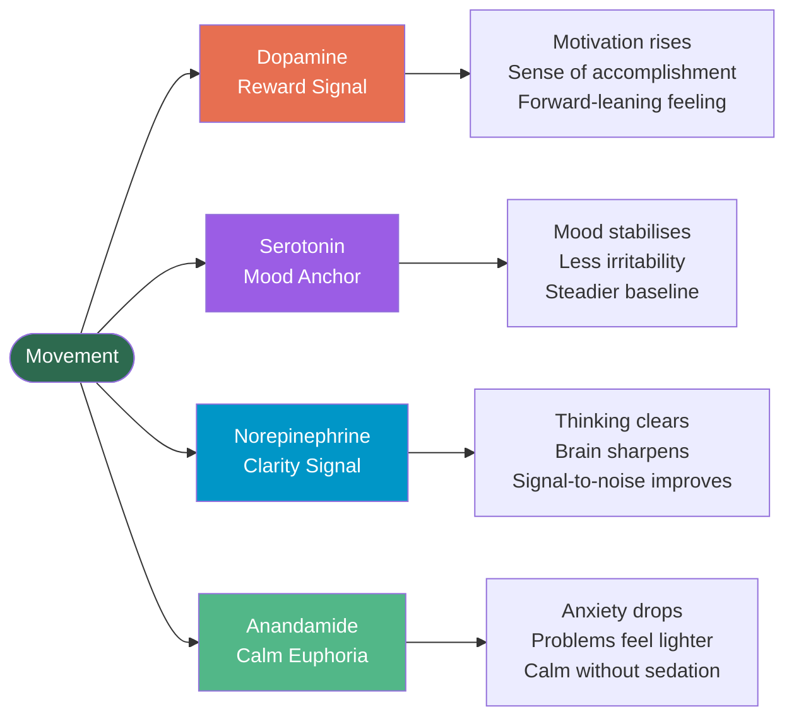
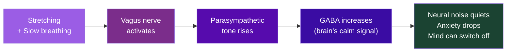
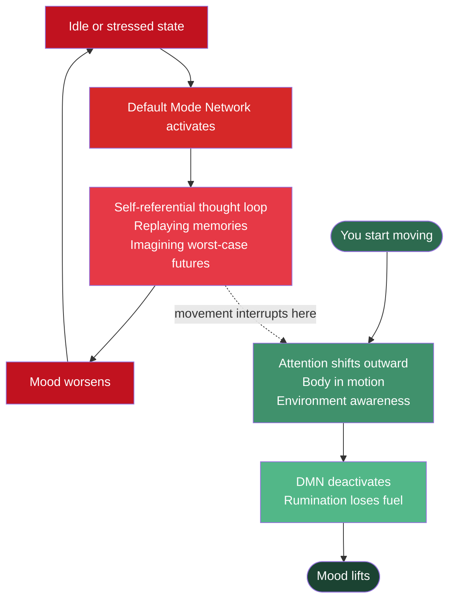
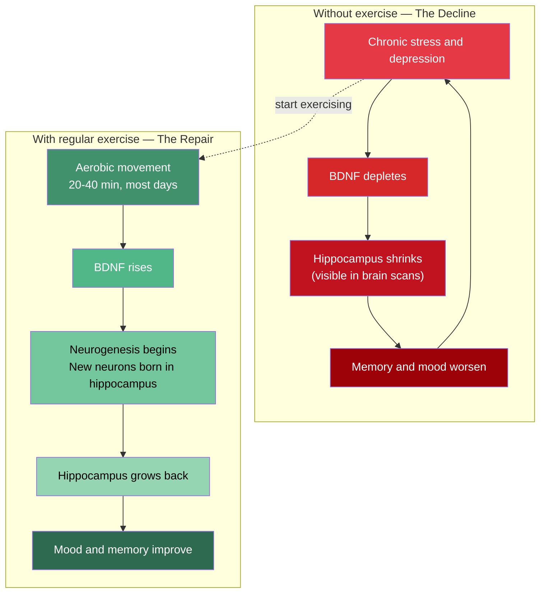
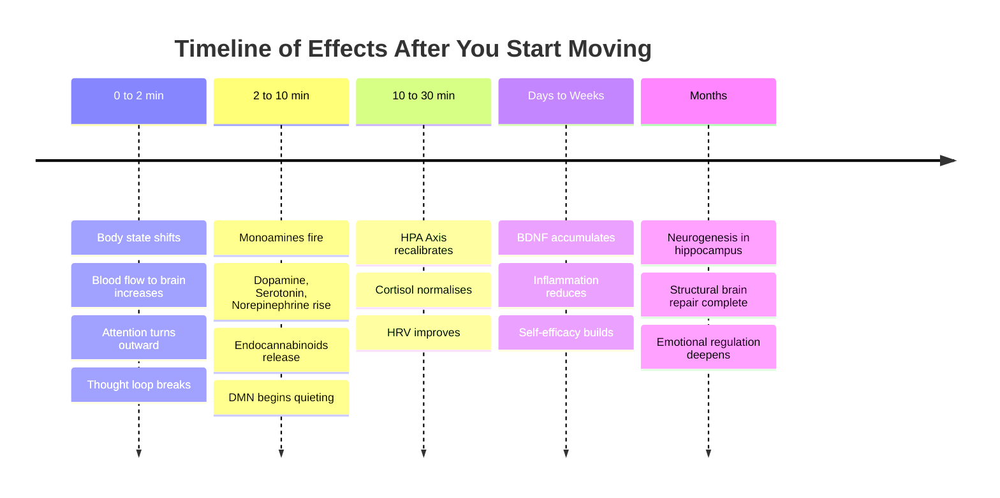
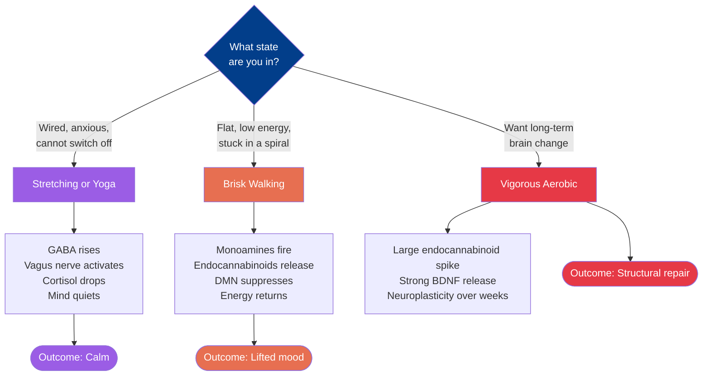
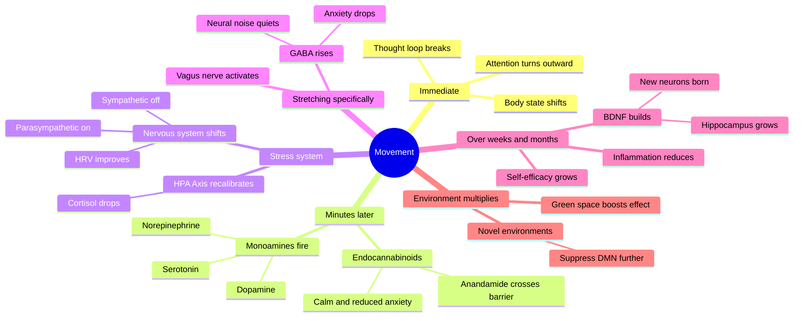

*And the real answer is stranger — and more useful — than anything I expected.*

---

I stretch for 5 minutes at 1am. Just a few simple stretches on the floor.

Then something shifts.

Not slowly. Not "after a few more minutes." Almost immediately — the tight loop in my head starts to loosen. The spiral of thoughts that felt inescapable a few minutes ago loses its grip. I feel a bit more calm. Clearer. Like someone turned down the volume on whatever was running loudly.

I've noticed this too many times to call it coincidence. Mid-afternoon, stuck in low energy — 3 minutes of walking and I'm back. 1am, negative thought spiral — 5 minutes of stretching and I can sleep. Works at different times, different starting states. Every time.

I wanted to understand why.

What I found was not what I expected. The real mechanism is ten layers deep, starts the moment you take a single step, and the explanation most of us grew up with? It was wrong.

---

> **Where this story goes:**

---

## The Effect Is Real

Start here, because this is where most people stop. They feel the effect but assume it's placebo. It isn't.

Controlled experiments have put people on treadmills and measured their mood before and after using validated psychological scales — not self-reports, not impressions, but standardised measurement tools used in clinical settings. A single bout of walking, as brief as 10 minutes, produces significant improvements in mood, energy, and tension reduction. Compared to a control group sitting quietly. In healthy people. In people with clinical depression. Consistently. [^1]

The effect is real. Everything below explains the mechanism.

---

## The Question Everyone Gets Wrong

For decades, the explanation was clean. Exercise releases endorphins. Endorphins make you feel better. That's the whole story.

*It was neat. It made sense. It got taught in schools. It was repeated everywhere.*

==It was also wrong.==

Researchers gave participants a drug called naltrexone — a substance that completely blocks opioid receptors, the specific docking ports that endorphins attach to, the same ones morphine attaches to. Then they asked those participants to exercise. If endorphins were responsible, blocking their receptors should have killed the effect entirely.

==The euphoria came anyway. Completely unaffected.== [^3]

Something else was responsible. And it turned out to be stranger and more interesting than the endorphin story ever was.

> **The experiment that broke the theory:**

---

## Your Body Makes Its Own Cannabis

Your body produces cannabis-like molecules. It has been doing this your whole life.

They're called **[[Endocannabinoids]]** — "endo" just means *inside the body*. The most studied one is called **[[Anandamide]]**, named from the Sanskrit word *ananda*, meaning bliss. These molecules bind to the same receptors that cannabis does. The difference is your body makes them itself, on demand.

After the naltrexone experiments ruled out endorphins, researchers turned to the endocannabinoid system. What they found was decisive: anandamide levels spike significantly after moderate-intensity aerobic exercise. Even walking at moderate intensity triggers this.

Here's the part that actually matters. Endorphins are large molecules. They cannot cross the **[[Blood-Brain Barrier|blood-brain barrier]]** — the protective filter that controls what enters the brain from the bloodstream. They flood the body but never reach the brain directly.

Anandamide is small and fat-soluble. It crosses the blood-brain barrier freely. [^3]

That's the actual mechanism. The calm euphoria. The reduced anxiety. That feeling where problems temporarily lose their weight. Your own endocannabinoid system producing exactly the state it was designed to produce. [^4]

==You don't need to run a marathon. Walking is enough.==

> **Why anandamide reaches the brain when endorphins cannot:**

---

## Four Chemicals. One Trigger.

Anandamide isn't the only actor. Within minutes of starting to move, the brain begins releasing a group of chemical messengers called **[[Monoamines]]** — think of them as the brain's postal workers, carrying signals between cells. Three of them are central to mood. [^2]

**[[Dopamine]]** creates the "this was worth it" feeling. Not just motivation — that quiet sense of accomplishment after you finish even a short walk. Not just calm. Forward-leaning. Like something good is possible.

**[[Serotonin]]** is the emotional anchor. Low serotonin is closely linked to depression and irritability. Movement increases serotonin — which is why regular movers tend to have a more stable emotional baseline. Not dramatically happy. Just steadier. That's actually more useful than a spike.

**[[Norepinephrine]]** improves the brain's signal-to-noise ratio. This is why thinking clears after a walk. Not because you solved anything — norepinephrine literally tunes the radio off static.

These three work together. The ratio between them matters. Exercise helps restore the balance. That balance is what we experience as "feeling normal again."

> **Four chemicals. Four effects. One trigger:**

---

## The Stress Machine — and How Movement Resets It

There's a command centre in the body called the **[[HPA Axis]]** — Hypothalamic-Pituitary-Adrenal axis. Three glands (two in the brain, one above each kidney) that work together to manage the stress response. When you're stressed, this system releases **[[Cortisol|cortisol]]**, the primary stress hormone.

Cortisol isn't the enemy. In short bursts, it's useful — it helps you respond to real threats. The problem is when it stays elevated. High cortisol over time damages mood, disrupts sleep, and impairs memory. [^5]

Exercise does something precise here. A single session temporarily raises cortisol (because movement is a mild physical stressor), but then the system recalibrates and drops below baseline. Over time, regular exercise trains the HPA axis to be less reactive — lower baseline cortisol, faster recovery after stress. [^5]

The second mechanism is the **[[Autonomic Nervous System|autonomic nervous system]]** — the part of your nervous system that runs automatically, controlling heart rate, digestion, and breathing. It has two modes:

- **[[Sympathetic Nervous System|Sympathetic]]** (fight-or-flight): alert, activated. The accelerator pedal.
- **[[Parasympathetic Nervous System|Parasympathetic]]** (rest-and-digest): calm, recovery. The brake pedal.

Modern stress keeps most people in low-level sympathetic activation — the engine idling in stress mode all day. Moderate walking and especially stretching shifts the balance toward parasympathetic dominance.

There's a measurable signal for this shift: **[[Heart Rate Variability|heart rate variability (HRV)]]** — the variation in time between each heartbeat. Counterintuitively, *more* variation is better. It means your nervous system is flexible, not locked in one gear. Studies show that walking in green spaces produces over 100% improvement in HRV markers compared to walking in urban settings. [^6] Not just feeling calmer. Measurably calmer.

---

## Why Stretching Feels Different From Walking

This is one of the more surprising findings in this area. Stretching and yoga don't just produce more of the same effects as walking. They activate a different mechanism entirely.

The key chemical is **[[GABA]]** — gamma-aminobutyric acid. It's the brain's primary *inhibitory* (calming) signal. When GABA fires, it tells the brain to quiet its activity — it reduces neural noise. Many anti-anxiety medications (like benzodiazepines, the category that includes Valium) work by artificially amplifying GABA. Low GABA is associated with anxiety and that "cannot switch off" feeling.

A landmark study compared 12 weeks of yoga against 12 weeks of metabolically matched walking — same calorie burn, same duration. Yoga produced greater mood improvements and larger reductions in anxiety. When researchers measured brain GABA levels using MRI spectroscopy (a brain imaging method that detects chemical concentrations), yoga had significantly increased GABA. Walking had not produced the same effect. And the GABA increase directly correlated with the reduction in anxiety scores. [^7]

> [!important] Landmark finding
> This was the **first study to show that a behavioural intervention — not a drug — could measurably increase brain GABA.**

The mechanism runs through the **[[Vagus Nerve|vagus nerve]]** — a long nerve running from the brainstem through the chest and into the belly, connecting the brain to most of the body's organs. Slow, controlled breathing activates the vagus nerve. The vagus nerve increases parasympathetic tone. That increases GABA. Stretching and breathing together create a compound effect that brisk walking doesn't replicate.

This is why 5 minutes of stretching at 1am can quiet a restless mind in a way that 5 minutes of brisk movement sometimes cannot.

> **The pathway from stretch to silence:**

---

## The Spiral Has an Off Switch

This is the section that explains the most important thing.

When you're not actively doing something — not working, not talking — your brain doesn't go quiet. It activates a network of regions called the **[[Default Mode Network]]** (DMN). Your brain's idle mode. Its job: self-referential thought. Replaying past events. Imagining future scenarios. Thinking about yourself in relation to other people.

Not inherently bad. Creative insight comes from here. So does empathy.

But the DMN has a dark side.

In people with depression, brain scans (fMRI studies that show which regions are active in real-time) show the DMN is hyperactive — specifically, the circuits linking the front of the brain to deeper emotional regions. The more active this loop, the more **[[Rumination]]** — the mental habit of replaying the same negative thoughts, the same fears, the same regrets, on repeat. Like a song you cannot get out of your head, except the song is a worry. The more rumination, the worse the mood. It feeds itself. [^10]

That negative thought spiral at night? That's an overactive Default Mode Network running a self-referential loop without an off switch.

> [!quote]
> **Movement is the off switch.**

When your body is physically engaged — navigating space, monitoring balance, responding to the environment — the DMN loses power. Attentional resources are pulled outward. The brain is occupied. The loop has no fuel.

This is not distraction in the trivial sense. ==You're not just taking your mind off things. You're **deactivating the network that generates the thing.**==

> **The rumination trap — and exactly where movement breaks it:**

---

## The Brain Actually Grows Back

Everything above describes what happens in the first hour. This is about what happens over weeks.

The brain has a molecule called **[[BDNF]]** — Brain-Derived Neurotrophic Factor. Think of it as fertiliser for the brain. It grows new neurons, strengthens connections between existing ones, and repairs neural circuits that chronic stress has damaged. [^8]

Here's what depression does to the brain: it depletes BDNF. Particularly in the **[[Hippocampus]]** — a seahorse-shaped region deep in the brain that manages memory, learning, and emotion regulation. Chronically low BDNF causes the hippocampus to physically shrink. This is not metaphor. Depressed brains show measurable atrophy in this region, visible in brain scans. [^8]

Exercise reverses this.

A single aerobic session raises circulating BDNF. Regular sessions raise the baseline — and amplify the BDNF spike from each subsequent session. Over weeks and months, this triggers **[[Neurogenesis]]** — the birth of new neurons in the hippocampus — and increases **[[Neuroplasticity]]** (the brain's ability to change, adapt, and form new connections) across mood-relevant circuits. [^8]

> [!important] Research finding
> Multiple clinical trials have found exercise to be **as effective as antidepressants** for mild to moderate depression. [^9]

==It is not a mood trick. It is structural repair.== **The brain grows back.**

> **The decline — and how exercise reverses it:**

---

## The Hidden Saboteur

There's one more mechanism that doesn't get enough attention.

Chronic low-grade inflammation — not from injury, but from the combination of stress, poor sleep, processed food, and sedentary behaviour — causes the immune system to release proteins called **[[Pro-Inflammatory Cytokines|pro-inflammatory cytokines]]** (chemical signals the immune system uses to communicate). Specifically IL-6 and TNF-α. These proteins cross into the brain and interfere with serotonin production, dopamine signalling, and BDNF levels. [^11]

Inflammation is now considered a significant biological mechanism in depression — not just a side effect of it.

Exercise directly counters this. Regular physical activity reduces pro-inflammatory cytokines and increases anti-inflammatory ones (particularly IL-10 — a calming signal to the immune system).

Mood improves not just through neurotransmitters. Through a quieter, cleaner internal chemistry.

---

## The Part That Isn't Chemistry

Not everything that explains exercise's effect on mood is biological. Some of the most consistent mechanisms are psychological — and they deserve equal credit.

**The distraction effect.** The brain cannot fully sustain both inward negative cycling and outward physical navigation at the same time. Movement forces a context switch. This is a real and significant mechanism in its own right — not just a side effect of the chemistry. [^12]

**[[Self-Efficacy|Self-efficacy]]** — the quiet confidence that "I can handle this." Every time you complete a walk or a stretch session — especially when you didn't feel like starting — you accumulate micro-evidence that you can do hard things. Multiple systematic reviews identify self-efficacy as one of the strongest psychological mediators between physical activity and reduced depression. You're not just changing your chemistry. You're changing your relationship to your own capability. [^12]

**[[Interoception]]** — your ability to sense what's happening inside your own body: tension in the shoulders, tightness in the hips, your own breathing rhythm. Stretching increases this awareness. You cannot regulate what you cannot sense. Every stretch session is partly a practice in learning to sense.

---

## Where You Move Matters

The same body, doing the same movement, in a different environment, produces measurably different results.

A study measuring cortisol and HRV found that walking in green spaces reduced cortisol by 53% on average. The same duration of walking in an urban environment reduced it by 37%. [^6] Same movement. Different outcome.

This is explained by **[[Attention Restoration Theory]]** — the idea that natural environments provide a kind of effortless, soft attention that allows your directed attention (the focused kind you use for work and problem-solving) to rest and recover. The combination of movement and nature isn't additive. It's multiplicative — the effects compound beyond what either produces alone.

Novel environments also add mild curiosity and sensory engagement, which further suppresses the DMN and keeps the mind anchored outward. Walking somewhere new adds something beyond just the movement. The brain is exploring, not cycling.

---

## How Little Is Actually Enough

The threshold is much lower than most people assume.

- **10 minutes** brisk walking → measurable mood improvement, comparable to a brief guided meditation
- **~20 minutes** → plateau point for acute mood effects (longer is not always better)
- **20–40 min, most days, 6–12 weeks** → structural brain change via BDNF

For the endocannabinoid effect, the key variable is **intensity**, not duration. The sweet spot: breathing noticeably, but still able to hold a conversation.

The worst thing is waiting until you feel motivated. The mechanism runs in both directions.

> [!quote]
> You don't move because you feel good. **You feel good because you moved.**

> **When does each effect arrive?**

---

## Pick Your Tool

They are not interchangeable. Walking, stretching, and vigorous aerobic exercise engage overlapping but distinct pathways.

| What you do | Primary mechanisms | Best for |
|---|---|---|
| **Brisk walking** | Monoamines, endocannabinoids, HRV increase, DMN suppression | Energy, mood lift, clearing thinking, mild anxiety reduction |
| **Stretching / yoga** | GABA increase, vagal activation, parasympathetic dominance, cortisol reduction | Calming, anxiety reduction, sleep, quieting a restless mind |
| **Vigorous aerobic** | Large endocannabinoid spike, endorphins, strong BDNF release | Euphoria, stronger antidepressant effect, long-term brain repair |

Quick decision guide:
- **Wired and anxious** → stretching with slow breathing will calm you faster
- **Flat, low-energy, or stuck in a spiral** → brisk movement will lift you faster
- **Long-term structural change** → sustained aerobic activity is the most potent tool

> **Which one right now?**

---

## Why This Works at 1am

One of the most interesting properties of this whole system: it doesn't care what time it is.

The mechanisms — endocannabinoid release, monoamine modulation, DMN suppression, GABA increase — are not circadian (tied to the body's 24-hour clock). They fire on demand. Day or night.

What does vary at 1am is baseline arousal. In a negative thought spiral at night, the sympathetic nervous system is elevated. The DMN is overactive. Cortisol may be dysregulated. What's needed is parasympathetic activation and DMN quieting. Both happen with even a few minutes of slow, deliberate movement.

There's also a grounding effect: moving through space redirects neural processing toward **[[Proprioception]]** — your body's sense of its own position and movement, how you know your arm is raised even with your eyes closed. The brain is occupied. The spiral has no fuel.

Evolution built a fast reward for movement precisely because moving was essential to survival. The threshold for DMN suppression and monoamine release is low. ==Three minutes is enough. Five is plenty.==

---

## The Full Cascade

This is not one mechanism. It is ten, layered. And they start the moment you take a single step.

1. **Loop breaks** — the body shifts from inward to outward attention, interrupting rumination immediately
2. **Monoamines fire** — dopamine, serotonin, norepinephrine rise within minutes, improving mood, motivation, and clarity
3. **Endocannabinoids release** — anandamide crosses the blood-brain barrier, producing calm euphoria and reduced anxiety
4. **Stress system recalibrates** — HPA axis moderates, cortisol normalises, HRV improves toward parasympathetic dominance
5. **GABA rises** — the brain's inhibitory signal quiets neural noise and anxiety (especially with stretching)
6. **Default Mode Network quiets** — the engine of rumination loses power
7. **BDNF builds over time** — the brain physically grows denser, more resilient, better connected
8. **Inflammation reduces** — chronic low-grade inflammation that disrupts neurotransmitters slowly resolves
9. **Psychology reinforces** — self-efficacy builds, mastery accumulates, the brain learns that movement is safe and rewarding
10. **Context amplifies** — green space, novelty, and outdoor environments compound every effect above

---

## Reference Map — Every Mechanism

*Now that you've read the full story, here's all of it in one view:*

---

*One question I'm still sitting with: what's the minimum movement threshold for DMN suppression? Does it require rhythmic locomotor movement — or can stillness and breath achieve it? I don't know yet.*

---

> [!note]- Glossary
>
> **Anandamide** — A natural chemical your body produces that binds to the same receptors as cannabis. Named from the Sanskrit word *ananda*, meaning bliss. Released during exercise; responsible for the calm euphoria that follows movement.
>
> **Attention Restoration Theory** — The idea that natural environments restore your brain's focused attention by providing soft, effortless stimulation — giving your directed attention a chance to rest and recover.
>
> **Autonomic nervous system** — The part of your nervous system that runs automatically, without conscious control. Manages heart rate, digestion, and breathing through two opposing modes: sympathetic (fight-or-flight) and parasympathetic (rest-and-digest).
>
> **BDNF (Brain-Derived Neurotrophic Factor)** — A protein that acts like fertiliser for the brain. Grows new neurons, strengthens existing connections, and repairs circuits damaged by chronic stress. Exercise raises BDNF; depression and inactivity deplete it.
>
> **Blood-brain barrier** — A protective filter between the bloodstream and the brain that tightly controls which substances can enter. Large molecules like endorphins are blocked; small, fat-soluble molecules like anandamide pass freely.
>
> **Cerebral blood flow** — The flow of blood to the brain, delivering oxygen and glucose (fuel) and clearing metabolic waste. Measurably decreases during prolonged sitting; increases immediately with movement.
>
> **Cortisol** — The body's primary stress hormone. Useful in short bursts to respond to real threats; harmful when chronically elevated. Exercise initially raises cortisol briefly, then drops it below baseline — training the stress system to be less reactive over time.
>
> **Default Mode Network (DMN)** — A brain network that activates during idle states — when you're not focused on a task. Its job: self-referential thought (replaying the past, imagining futures). When overactive, it drives rumination. Movement suppresses it.
>
> **Dopamine** — A neurotransmitter that creates the sense of reward, motivation, and forward momentum. Produces the "this was worth it" feeling after completing even a short walk. Released during exercise.
>
> **Endocannabinoids** — Natural cannabis-like molecules produced inside your own body. They bind to the same receptors as cannabis and regulate mood, pain, and stress. The most studied one is anandamide.
>
> **Endorphins** — Natural opioid-like molecules produced during exercise. Long believed to be the source of exercise-induced euphoria — but since they cannot cross the blood-brain barrier, they are not the primary mood mechanism.
>
> **GABA (Gamma-Aminobutyric Acid)** — The brain's primary calming signal. When GABA fires, it tells the brain to reduce its activity and lower neural noise. Many anti-anxiety medications work by artificially amplifying GABA. Yoga and stretching raise it directly.
>
> **Heart rate variability (HRV)** — The variation in time between each heartbeat. More variation is healthier — it means the nervous system is flexible and not locked in stress mode. Higher HRV indicates parasympathetic (calm) dominance.
>
> **Hippocampus** — A seahorse-shaped brain region that manages memory, learning, and emotion regulation. One of the few brain regions where new neurons can grow in adulthood. Chronic stress shrinks it; regular exercise helps it grow back.
>
> **HPA Axis (Hypothalamic-Pituitary-Adrenal)** — Three glands (two in the brain, one above each kidney) that coordinate the body's stress response. Regular exercise trains this axis to be less reactive — producing lower baseline cortisol and faster recovery from stress.
>
> **Interoception** — Your ability to sense what's happening inside your own body: muscle tension, breathing rhythm, heartbeat, hunger. Stretching and mindful movement improve interoceptive awareness. You can only regulate what you can sense.
>
> **Monoamines** — A class of chemical messengers in the brain that regulate mood, motivation, and alertness. The three central to mood are dopamine, serotonin, and norepinephrine — all released during exercise.
>
> **Neurogenesis** — The birth of new neurons (brain cells). Occurs primarily in the hippocampus. Regular aerobic exercise is one of the most reliable triggers for adult neurogenesis.
>
> **Neuroplasticity** — The brain's ability to change, adapt, and form new connections throughout life. Exercise increases neuroplasticity, making the brain more resilient and capable of recovery.
>
> **Norepinephrine** — A neurotransmitter that improves the brain's signal-to-noise ratio — sharpening focus and mental clarity. Released during exercise; explains why thinking often clears after a short walk.
>
> **Opioid receptors** — Molecular docking stations in the brain and body where opioid molecules (including endorphins and drugs like morphine) attach. Blocking them with naltrexone was the experiment that proved endorphins are not the primary exercise-mood mechanism.
>
> **Parasympathetic nervous system** — The "rest-and-digest" mode of the autonomic nervous system. Active during calm, recovery states. Exercise and slow breathing shift the body toward parasympathetic dominance.
>
> **Pro-inflammatory cytokines** — Chemical signals (specifically IL-6 and TNF-α) released by the immune system during low-grade inflammation. They can cross into the brain and suppress serotonin and dopamine signalling, directly affecting mood.
>
> **Proprioception** — Your body's sense of its own position and movement in space — how you know where your limbs are without looking. Moving through space activates proprioception, anchoring the brain's attention outward and away from thought loops.
>
> **Rumination** — The mental habit of repeatedly cycling through the same negative thoughts, fears, or regrets without reaching resolution. Strongly associated with overactivity in the Default Mode Network.
>
> **Self-efficacy** — The quiet confidence that you are capable of handling challenges. Builds gradually through completing tasks — including small ones like a 10-minute walk. One of the strongest psychological mediators between exercise and reduced depression.
>
> **Serotonin** — A neurotransmitter that acts as an emotional anchor. Low serotonin is linked to depression and irritability. Exercise raises serotonin, producing a steadier, more stable emotional baseline.
>
> **Sympathetic nervous system** — The "fight-or-flight" mode of the autonomic nervous system. Activated during stress and perceived threat. Chronic low-level sympathetic activation — the modern default — keeps the body in a state of mild, sustained stress.
>
> **Vagus nerve** — The longest nerve in the body, running from the brainstem through the chest and into the abdomen, connecting the brain to most organs. Slow, controlled breathing activates it, increasing parasympathetic tone and raising GABA levels.

---

## Sources

[^1]: [Experimental effects of brief, single bouts of walking and meditation on mood profile — PMC](https://pmc.ncbi.nlm.nih.gov/articles/PMC6064756/)
[^2]: [Exercise Benefits Brain Function: The Monoamine Connection — PMC](https://pmc.ncbi.nlm.nih.gov/articles/PMC4061837/)
[^3]: [Exercise-induced euphoria and anxiolysis do not depend on endogenous opioids in humans — ScienceDirect](https://www.sciencedirect.com/science/article/abs/pii/S0306453021000470)
[^4]: [A Systematic Review and Meta-Analysis on the Effects of Exercise on the Endocannabinoid System — PMC](https://pmc.ncbi.nlm.nih.gov/articles/PMC9418357/)
[^5]: [Central Mechanisms of HPA axis Regulation by Voluntary Exercise — PMC](https://pmc.ncbi.nlm.nih.gov/articles/PMC3010733/)
[^6]: [Is Greener Better? Quantifying the Impact of a Nature Walk on Stress Reduction Using HRV and Saliva Cortisol Biomarkers — PMC](https://pmc.ncbi.nlm.nih.gov/articles/PMC11594215/)
[^7]: [Effects of Yoga Versus Walking on Mood, Anxiety, and Brain GABA Levels: A Randomized Controlled MRS Study — PMC](https://pmc.ncbi.nlm.nih.gov/articles/PMC3111147/)
[^8]: [Exercise improves depression through positive modulation of BDNF — PMC](https://pmc.ncbi.nlm.nih.gov/articles/PMC10030936/)
[^9]: [The impact of exercise on depression: how moving makes your brain and body feel better — PMC](https://pmc.ncbi.nlm.nih.gov/articles/PMC11298280/)
[^10]: [Rumination and the Default Mode Network: Meta-analysis — ScienceDirect](https://www.sciencedirect.com/science/article/pii/S105381191930878X)
[^11]: [Pro-Inflammatory Cytokines as Predictors of Antidepressant Effects of Exercise — PMC](https://pmc.ncbi.nlm.nih.gov/articles/PMC3511631/)
[^12]: [Exercise and clinical depression: examining two psychological mechanisms — ScienceDirect](https://www.sciencedirect.com/science/article/abs/pii/S1469029203000748)
