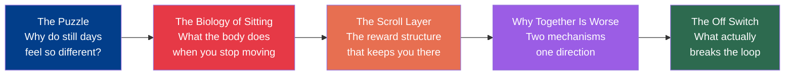
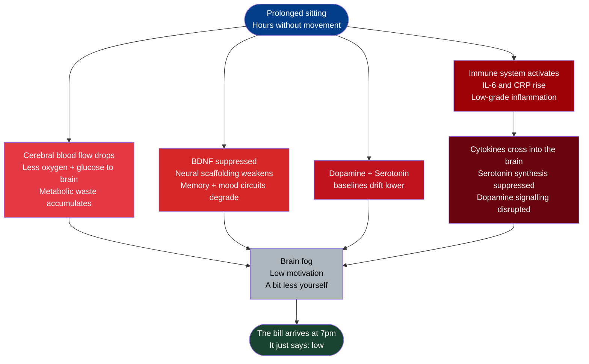
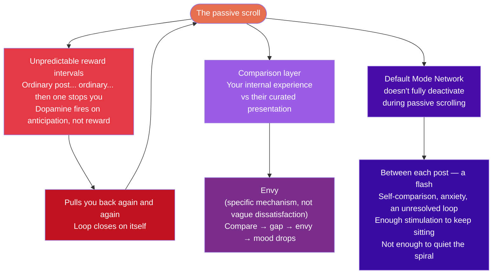
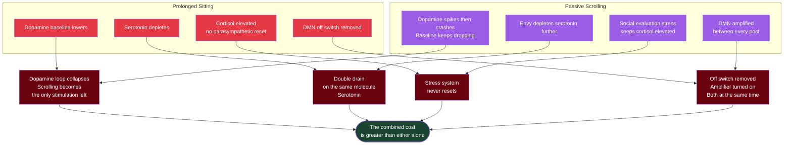

# Being Dormant Is Sickness

Last Tuesday, I spent most of the day on my couch. Not sick. Not tired in the traditional sense. Just still. Laptop on the table, phone in hand, scrolling through things I don't remember anymore. By 7pm, I felt heavier than I had at 9am. Low energy, irritable, a vague fog I couldn't explain.

I hadn't eaten badly. I had slept well. Nothing had actually gone wrong.

But something had happened.

I've been sitting with this observation for weeks — the strange cost of stillness. Days I move, even a little, feel different. Better. Days I don't, I pay for it in ways that don't show up immediately. The bill arrives quietly, around mid-afternoon, and it just says: *low*.

I think most of us explain this the wrong way.

The popular story is: you scroll bad news, compare yourself to highlight reels, and get depressed. The fix, then, is to curate your feed. Follow positive accounts. Use social media more intentionally. That story has truth in it. But it misses something deeper.

You could scroll nothing but sunsets and puppies — and the biology of sitting still for hours would still extract its cost. The content problem is real. But it sits on top of a more fundamental problem. One that runs silently, regardless of what you are looking at.

---

> **Where this story goes:**

---

## What Prolonged Sitting Actually Does

When you stop moving, your brain starts running on less fuel. Literally.

**[[Cerebral Blood Flow|Cerebral blood flow]]** — the flow of blood to the brain that carries oxygen, delivers glucose, and clears metabolic waste — measurably decreases when you sit without moving for extended periods. The brain doesn't announce this. You don't feel a warning. You just slowly become less sharp, less motivated, a bit less yourself.

Then there's **[[BDNF]]** — Brain-Derived Neurotrophic Factor, which is essentially fertiliser for the brain. It grows new neurons, strengthens connections, maintains the regions involved in memory and mood regulation. Sedentary behaviour suppresses it. Not dramatically on day one. But consistently, over days of stillness, the biological scaffolding of your emotional regulation quietly weakens. [^1]

Dopamine and serotonin baselines drift lower too. These are the same neurotransmitters that movement raises within minutes. Their absence doesn't feel like anything distinct. It just feels like your normal. But it isn't the same normal as someone who has been moving.

And then — the part I find most unsettling — your immune system gets involved.

Prolonged physical inactivity triggers a low-grade inflammatory response. The body starts producing signals called **[[Pro-Inflammatory Cytokines|cytokines]]** — chemical signals the immune system uses to communicate, specifically IL-6 and CRP — as if something is metabolically wrong. Because something is. These signals cross into the brain and directly suppress serotonin synthesis and disrupt dopamine signalling. A 2021 study found sedentary time was directly associated with elevated levels of both biomarkers. [^4]

==This isn't a side effect of feeling bad. It's a primary pathway *to* feeling bad.==

*You don't feel inflamed. There's no pain.* But at the cellular level, ==your mood is being chemically suppressed by your own immune system — responding to stillness.==

> **The biology runs on its own. Four pathways. One direction.**

---

## What the Scroll Does on Top of That

Now add the phone.

The social media scroll is not, at its core, a content problem. It's a reward structure problem.

The feed is engineered on the same principle as a slot machine — **unpredictable reward intervals**. Most posts are ordinary. Some make you laugh. One stops you completely. You don't know which comes next. And your dopamine system, which fires on the *anticipation* of uncertain reward — not just the reward itself — pulls you back again and again. Brain imaging research shows that compulsive digital use disrupts the same dopamine reward circuitry implicated in substance addiction. [^7] Not because the content is a drug. Because the reward *structure* is.

> [!quote]
> The content is not the drug. ==The uncertainty is the drug.==

Then there's the comparison layer. Every scroll exposes you to other people's lives — selected, filtered, presented for maximum appeal. Your brain automatically compares your internal experience — your current boredom, your private worries, the quiet ordinariness of your afternoon — against their curated external presentation. Research is clear on what mediates this: **[[Envy]]**. [^6] Not abstract dissatisfaction. Envy, specifically. Compare → notice the gap → feel envy → mood drops.

And here's what I hadn't understood until recently. The passive scroll doesn't quiet the mind the way I assumed it did.

The brain has a circuit called the **[[Default Mode Network]]** — its idle mode, the engine that runs self-referential thought loops when you're not actively engaged in the world. Replaying the past. Imagining worst-case futures. Running worries on repeat. This circuit doesn't fully deactivate during passive scrolling. You're consuming content, but you're not actively creating, problem-solving, or navigating physical space. Between each post, the DMN fires — a flash of self-comparison, a moment of anxiety, a brief loop of something unresolved. The scroll provides just enough stimulation to keep you sitting, but not enough engagement to quiet the network generating the negative thought spirals.

==Movement is the most reliable way to switch off that network. Passive scrolling amplifies it.==

> **Three mechanisms. All running at once.**

---

## Why Together Is Worse Than Either Alone

This is the part that I actually find important.

These are not two separate problems that add up. They're two mechanisms depleting the same systems, in the same direction, at the same time.

**[[Dopamine]]:** Movement deprivation lowers the baseline. The scroll creates spikes that crash fast. The baseline keeps dropping while the spikes become the only reliable stimulation — which drives more scrolling to fill the gap.

**[[Serotonin]]:** Prolonged sitting depletes it. Social comparison-driven envy depletes it further. Two simultaneous drains on the same molecule.

**The stress system** never gets the parasympathetic recovery it needs to reset — because movement is what triggers that reset, and the social evaluation stress of passive scrolling keeps cortisol elevated from the other direction.

**The rumination engine:** Movement is the off switch. Passive scrolling is the amplifier. Both running at once.

==You're not doing one thing wrong. You're doing two things that hit the same systems in the same direction at the same time.== The combined cost is greater than either alone.

> [!important] The numbers
> A meta-analysis in *The Lancet* pooled data from over **1 million people** across 16 studies. Sitting more than 8 hours/day with low physical activity = **59% higher mortality risk** vs. the most active group. [^2]
> A 2024 *JAMA Network Open* study of **481,688 workers** over 13 years: mostly-sitting workers had **34% higher cardiovascular mortality** compared to those who stood or moved. [^3]

These numbers don't feel real in your early 30s. But I think the low mood and the foggy thinking are the early version of the same story. The biology doesn't wait until it kills you. It runs daily, quietly, below the threshold of what we name as symptoms.

> **Same systems. Both directions. At the same time.**

---

## What Actually Breaks the Loop

The threshold is much lower than most people assume.

Breaking up prolonged sitting — even with light-intensity movement — is enough to reset cerebral blood flow, interrupt the inflammatory cascade, and begin neurotransmitter recovery. [^1] Not running. Not the gym. Just not sitting continuously. 2 minutes of standing. A short walk. A stretch every 30 minutes.

On the social media side, the passive/active distinction turns out to matter more than total screen time. A study of 10,563 adolescents found that passive social media use — scrolling without posting or engaging — was significantly associated with anxiety and depressed mood, even after controlling for total time spent. The same study found active use — posting, responding, genuine conversation — was *not* associated with emotional distress. [^5] The question isn't how long you spent. It's whether you were participating or consuming.

I've been running this experiment for a few weeks. On days I break up sitting and shift toward active use over passive scrolling, the gap between how I feel at 9am and 7pm narrows considerably. Not dramatically. Just noticeably.

Actually, I'd say: ==it's not that movement makes me feel better. It's that sitting still is costing me something I didn't know I was spending.==

That's the shift in how I now think about this.

Not: *exercise is good for me.*

> [!quote]
> *Staying still is a cost I'm actively choosing to pay.*

> **Same time, different choices — different biology:**

```mermaid
flowchart TD
    Q{"What are you<br/>doing right now?"}

    Q -->|"Sitting +<br/>passive scroll"| W["Compound cost<br/>Both systems depleting<br/>simultaneously"]
    Q -->|"Sitting +<br/>active engagement"| M["Partial protection<br/>DMN more occupied<br/>Comparison loop quieter"]
    Q -->|"Moving +<br/>passive scroll"| B["Biological buffer active<br/>Movement partially offsets<br/>the scroll cost"]
    Q -->|"Moving +<br/>active creation"| BEST["All systems working for you<br/>Neurotransmitters rising<br/>DMN suppressed<br/>You at your clearest"]

    W --> FIX["Break it now<br/>2 min movement<br/>every 30 min<br/>is enough to reset"]

    style Q fill:#023e8a,color:#fff
    style W fill:#e63946,color:#fff
    style M fill:#e9c46a,color:#000
    style B fill:#52b788,color:#fff
    style BEST fill:#1b4332,color:#fff
    style FIX fill:#2d6a4f,color:#fff
```

The question isn't how to motivate yourself to move. The question is whether you understand what you're actually paying for when you don't.

---

*Are you noticing the same thing? Or have you found a version of stillness that doesn't cost you?*

---

> [!note]- Glossary
>
> **BDNF (Brain-Derived Neurotrophic Factor)** — A protein that acts like fertiliser for the brain. Grows new neurons, strengthens existing connections, and maintains the circuits involved in memory and mood regulation. Sedentary behaviour suppresses it; movement raises it.
>
> **Cerebral blood flow** — The flow of blood to the brain, delivering oxygen and glucose (fuel) while clearing metabolic waste. Decreases measurably during prolonged sitting, causing the fog and low motivation that builds through the day.
>
> **Cortisol** — The body's primary stress hormone. Elevated by both physical inactivity and by the social-evaluation stress that passive scrolling creates. Without movement to reset it, cortisol stays elevated and the stress system never recovers.
>
> **Cytokines (IL-6, CRP)** — Chemical signals produced by the immune system to communicate inflammation. Prolonged sedentary behaviour raises levels of pro-inflammatory cytokines. They cross into the brain and suppress serotonin and dopamine signalling directly.
>
> **Default Mode Network (DMN)** — A brain network that activates during idle states, running self-referential thought: replaying memories, imagining worst-case futures, cycling through worries on repeat. Passive scrolling does not fully deactivate it. Movement does.
>
> **Dopamine** — A neurotransmitter central to reward and motivation. Sedentary behaviour lowers the baseline over time. Social media feeds exploit the dopamine system through unpredictable reward intervals — creating fast spikes that crash, pulling the baseline down further.
>
> **Dopamine reward circuitry** — The brain's system for processing reward and anticipation. Engineered like a slot machine, social media feeds exploit this circuitry through variable reward intervals — the same circuitry implicated in addictive behaviour.
>
> **Envy** — The specific emotional mechanism that research identifies as driving the link between passive social media use and mood decline. Not vague dissatisfaction — envy specifically, produced by comparing your unfiltered internal experience against others' curated external presentation.
>
> **HRV (Heart Rate Variability)** — The variation in time between each heartbeat. More variation indicates a flexible, healthy nervous system in parasympathetic (calm) mode. Walking in green spaces produces significantly higher HRV improvement than urban walking.
>
> **Parasympathetic nervous system** — The "rest-and-digest" mode of the autonomic nervous system — the body's recovery state. Movement shifts the system toward parasympathetic dominance. Sitting still combined with passive scrolling prevents this shift from happening.
>
> **Pro-inflammatory cytokines** — Immune system chemical signals (IL-6 and CRP) associated with inflammation. Sedentary behaviour triggers their release even without injury or illness. They cross the blood-brain barrier and interfere with mood-regulating neurotransmitters.
>
> **Serotonin** — A neurotransmitter that stabilises mood and prevents irritability. Depleted by both prolonged sitting (via inflammation) and social comparison-driven envy — two simultaneous drains running in the same direction, on the same molecule.

---

## Sources

[^1]: Chandrasekaran et al. (2021) — Prolonged sitting, cognitive function, and physiological mechanisms — *BMC Musculoskeletal Disorders* — https://doi.org/10.1186/s12891-021-04136-5
[^2]: Ekelund et al. (2016) — Physical activity, sitting time, and all-cause mortality — *The Lancet* (1M+ participants) — https://doi.org/10.1016/S0140-6736(16)30370-1
[^3]: Gao et al. (2024) — Occupational sitting and cardiovascular mortality (481,688 participants) — *JAMA Network Open* — https://doi.org/10.1001/jamanetworkopen.2023.50680
[^4]: Firth et al. (2020) — Lifestyle psychiatry: exercise, diet, sleep, and sedentary behavior in mental disorders — *World Psychiatry* — https://doi.org/10.1002/wps.20773
[^5]: Thorisdottir et al. (2019) — Active vs passive social media use, anxiety, and depressed mood — *Cyberpsychology, Behavior and Social Networking* — https://doi.org/10.1089/cyber.2019.0079
[^6]: Wang et al. (2020) — Upward social comparison, envy, and depression on mobile social media — *Journal of Affective Disorders* — https://doi.org/10.1016/j.jad.2020.03.173
[^7]: Wang et al. (2019) — Internet gaming disorder: VTA-NAc dopamine pathway disruption — *Brain Imaging and Behavior* — https://doi.org/10.1007/s11682-018-9929-6
