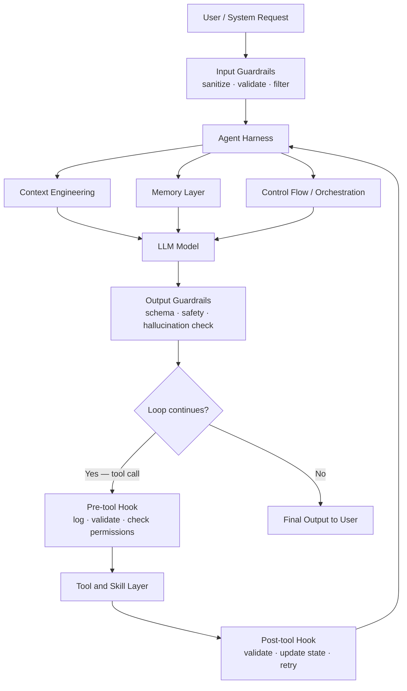
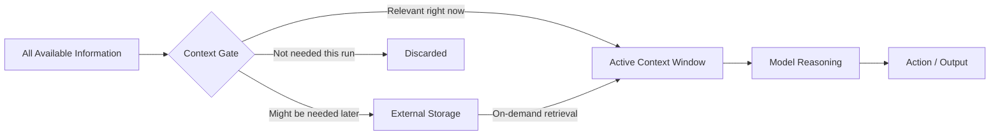
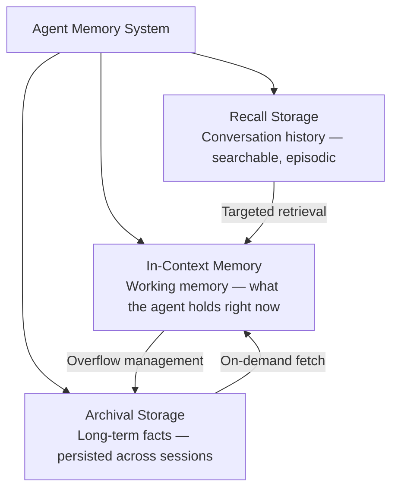
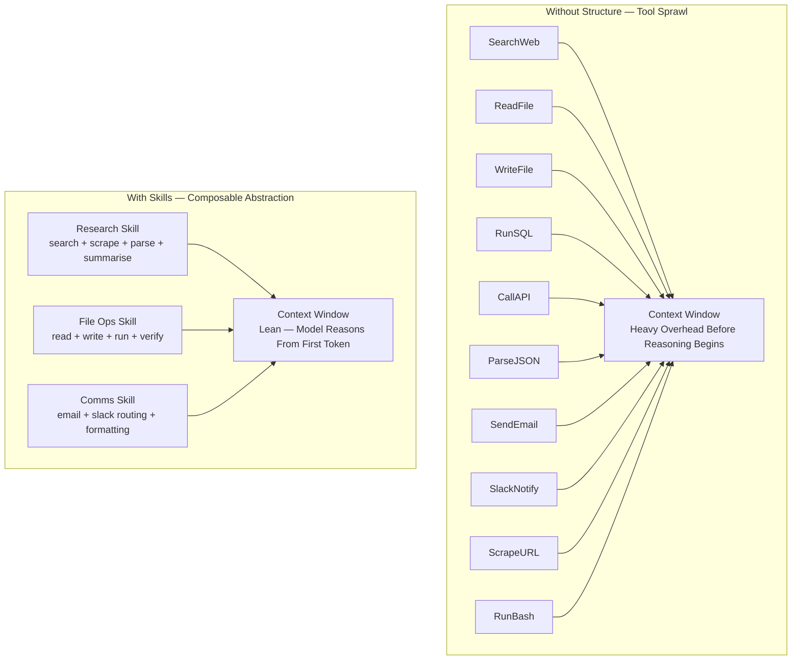
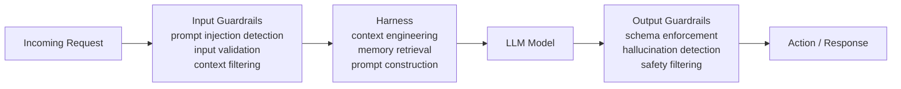
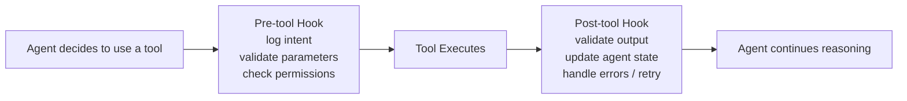
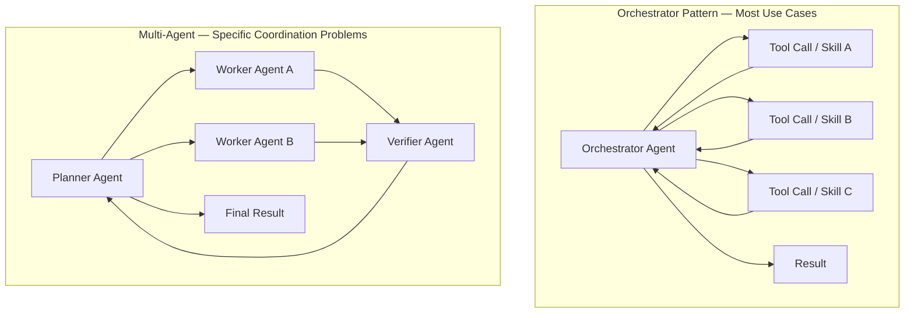

I was staring at my terminal one afternoon, watching [[Claude Code]] work through a bug in a Python service.

It called a tool to read the file. Then it analyzed the error. Then it searched the codebase for similar patterns. Then it wrote the fix, ran the test, observed the output, adjusted. No model switch. Same model the whole time.

But the output was sharper than anything I'd gotten from a raw API call to a bigger, more expensive model.

I sat back and thought: what exactly am I watching here?

---

### The belief that costs money

When I started working seriously with LLMs, I believed what most people building with them believe: the model is the product. Better model, better output. The infrastructure around it is temporary scaffolding — necessary now, irrelevant when the next frontier model arrives.

That belief is why most early AI products were thin wrappers around API calls. Why teams spend weeks debating GPT-5 vs Claude Sonnet vs Gemini, and then slap the winning model into a vague system prompt and call it an agent. The logic feels airtight: each model generation handles more, needs less hand-holding, absorbs what the previous one needed scaffolding for.

But here's what that belief costs in practice.

I've watched teams spend significant money on the most expensive model available, running it with bloated prompts, too many tools, no memory between sessions, and no way to observe what it was doing. The output was mediocre. They assumed the model wasn't capable enough and upgraded. The output improved marginally. They upgraded again.

The model was rarely the problem. But the upgrade was the first thing everyone reached for. Swap the API. Increase the budget. Run it again and hope.

Buying a bigger model and praying the agent performs is not an engineering strategy. It's a reflex. And it's expensive.

The belief underneath it is: if the agent isn't performing, the ceiling is the model. That assumption shapes every decision — which API to call, how much to budget, what to build. It is also, I now think, usually wrong.

---

### What I actually learned, in the order I learned it

I didn't arrive at the alternative in one moment. It came from a sequence of things, each one breaking a part of the original assumption.

The first crack was at [[Hypatos]], where I was building document processing agents with the [[Agno]] framework. [2] I was running a smaller model — not the flagship, not the most expensive option — but with tools designed around the actual task, structured memory across sessions, and a system prompt that did real work. The output was better than what the team had been getting from naive calls to a model two tiers above it. I couldn't explain it. I assumed I'd gotten lucky with the task.

Then it happened again on a different task. And again.

Then [[Anthropic]] introduced Skills for [[Claude Code]] — composable, installable agent behaviors packaged as [[SKILL.md]] directories. [6] The framing struck me: the improvement wasn't in the model. It was in the abstraction over how the model accessed its capabilities. A skill isn't a smarter model. It's a smarter context. The same model, given cleaner instructions and less clutter to navigate, reasoned better.

Then I read [[Manus]]'s published post on context engineering. [3] They had written down something I had been doing by instinct without being able to name it: context is a resource to be managed, not a dump to be filled. They were offloading tool outputs to the filesystem instead of accumulating them in message history. The model stayed lean. The results stayed sharp. They were engineering the input, not the model.

Then I went back to the [[MemGPT]] paper properly — now the [[Letta]] framework — which showed that memory isn't a feature you layer on top of an agent. [4] It is a fundamental architectural decision. Which information lives in-context, which goes to archival storage, which is retrieved on demand — get those transitions wrong and the agent degrades over time, regardless of which model is underneath it.

Then the number that confirmed all of it:

[[Claude Code]] runs on 512,000 lines of TypeScript. [1] Not model weights. Not training infrastructure. The full application — tools, memory management, context control, multi-agent coordination, IDE bridging. Anthropic, the company building the frontier model, needs half a million lines of infrastructure *around* it. They are not waiting for the model to absorb the harness. They are building the harness.

The model is a component. The harness is the architecture.

---

### What the harness actually is

An agent harness is the orchestration layer around the model. It manages everything the model doesn't manage itself. By the end of this, you'll see why the layers around the model — context, memory, tools, control flow, guardrails, and hooks — are where agent performance and reliability actually live.

The harness decides what the model sees (context), what it remembers (memory), what it can act on (tools and skills), and when to stop (control flow). Guardrails enforce boundaries at the edges — what goes in, what comes out. Hooks instrument every tool call in between. Every performance or safety problem in an agentic system I've debugged traces back to one of these six layers. Not the model.

When an agent behaves unexpectedly, the first question isn't "is this model good enough?" It's: which harness layer broke?

---

### Context: the most leveraged decision

Context engineering is probably the most underappreciated skill in AI development right now.

The naive version — give the model everything it might need and let it sort — is how most early [[RAG]] (Retrieval Augmented Generation: feeding the model relevant documents at query time) systems worked. Fill the window and hope.

What I learned from Manus is cleaner. [3] They treat context as a resource. What goes in, in what order, at what moment — engineering decisions, not afterthoughts. Concretely: rather than keeping tool outputs in message history, they dump them to the filesystem and pass the agent only a pointer. The context stays lean. The information is still reachable when needed.

A model with tight, well-sequenced context reasons better than the same model drowning in everything at once. I've seen it consistently: agents with elaborate tool setups performing worse than agents with a clear system prompt and minimal instructions. Prompt engineering and context engineering aren't the same thing, but they compound. Get one wrong and you're fighting the harness from the start.

Context engineering also saves tokens. Saved tokens save money. In production, running thousands of agent calls, this compounds fast. The engineer treating context as a first-class concern is also the engineer whose agent runs cheapest at scale.

---

### Memory: not a plugin, an architecture

The MemGPT paper reframed how I think about agent memory. [4]

The typical design is binary: everything the agent knows is either in the current context window, or in an external database it queries. MemGPT proposed a three-tier structure drawn from how operating systems manage hierarchical memory — fast access for what's needed now, slower storage for what's needed later, searchable history for what came before.

In-context memory is fast but constrained by the window. Archival storage persists facts across sessions — the agent remembers what it learned yesterday. Recall storage lets the agent search its own history, treating past conversations as evidence for current reasoning.

Designing those transitions explicitly — when does memory move from in-context to archival? what triggers a retrieval? — separates agents that compound knowledge over time from agents that restart from scratch every run.

Actually, the memory implementation I keep coming back to is the most low-tech one: a bash tool with filesystem access. A model that can read files, write files, run commands, and observe results can handle most agentic tasks without a dedicated memory manager. The filesystem is the memory. The bash tool is the interface. Manus uses the same instinct — offloading tool outputs to the filesystem to keep the context window lean. [3] The bash+filesystem pattern does both: it manages context exactly the way Manus does, and it provides persistence across runs without a dedicated memory manager. Some of my most efficient agents are built this way — leaner setup, surprisingly strong results.

---

### Tools: why more is worse

Tools are where I see the most common mistake.

Every tool definition occupies context. Ten tools means significant overhead before the agent has done anything — the model reads all tool descriptions at the start of every call. Add enough tools and you're spending context budget before the first reasoning step begins.

I've watched agents perform worse with more tools, not better. The model burns reasoning capacity navigating options it doesn't need for this specific task. More capability on paper, less performance in practice. Red Hat's analysis of Tool RAG research puts it plainly: "feeding all available tools into a single prompt overwhelms the model and degrades its performance." Across the underlying studies they surveyed, intelligent tool selection can triple tool invocation accuracy while halving prompt length. [5]

Skills solve this. A skill is a directory with a SKILL.md file: instructions, scripts, and resources the agent discovers and loads dynamically. [6] Instead of seeing ten raw tool descriptions, the model sees three skills with clear stated purposes. Less overhead. Better reasoning. I now group tools by what I'm trying to accomplish, not by what each function does. Research work gets a research skill that bundles search, scraping, and summarisation together. File work gets a file ops skill. The abstraction earns its place.

One more thing that often gets ignored: sequential tool calls are one of the biggest hidden latency sources in an agentic run. Where calls are independent of each other, run them in parallel. Async where possible. This alone cuts run time significantly on multi-step tasks — and in production, run time is user experience.

---

### Guardrails and hooks: the harness watching itself

The layers above — context, memory, tools — are about making the agent perform. These two are about making it safe enough to actually run.

Guardrails sit at the boundaries of the agent's world. Input guardrails intercept before the model sees anything. They sanitize user input, detect prompt injection attempts, and validate that what's arriving is what the system expects. Output guardrails intercept after the model responds but before the action lands. They check format, catch hallucinations, filter unsafe content, and enforce schema. [8]

In my experience, output guardrails matter more in production than input ones. A well-designed system prompt does a lot of input filtering already. But model output is where surprises live — wrong format, hallucinated values, confident answers to questions the model shouldn't be touching at all. Output guardrails are the last line before that reaches the user or another system.

Interaction-level guardrails go further still: in agentic systems, they limit how freely the model can act. Approval workflows for destructive operations. Dangerous command detection before a shell command runs. Doom loop detection when the agent is repeating itself. Claude Code implements all three. [1]

Hooks are different. They don't guard the boundary — they instrument the interior. Pre-tool hooks fire before a tool call executes. They log the intent, validate the parameters, and check whether this action is permitted at this point in the workflow. Post-tool hooks fire after. They validate what the tool returned, update agent state, handle errors, and trigger retry logic when something breaks. [9]

Claude Code uses this hook pattern throughout its own execution loop. Its implementation of the ReAct loop — the reason-act-observe cycle that drives most modern agents — adds explicit pre-check and post-processing phases at every tool execution step, on top of the base pattern. [1] What this means in practice: you can observe, modify, or block any action the agent wants to take, at the exact moment it wants to take it.

The combination is what makes an agent trustworthy enough to run unsupervised. Without guardrails and hooks, you have an agent that works in demos and fails quietly in production. With them, you have a system that fails gracefully, surfaces unexpected behavior, and gives you enough observability to actually improve it over time.

---

### One agent or many?

Multi-agent systems get a lot of attention. The assumption is that multiple specialized agents are inherently more capable than one orchestrator.

My experience: most use cases don't need them.

One orchestrator with clear tools, tight context, and well-designed skills handles more than people expect. Multi-agent adds coordination overhead, more failure points, harder tracing, and more context management burden. It's the right answer for genuinely parallel workloads and complex coordination problems where no single agent can hold the full picture. It is not a general upgrade.

The honest question before reaching for multi-agent: is there a coordination problem here that one orchestrator with parallel tool calls can't solve? Most of the time, the answer is no.

---

### Where I'm less certain

The memory ownership argument — that closed harnesses trap your data — is real. But it's more complicated than it sounds. [7]

My honest take: if you're passing data through a third-party model API, your data is going through someone else's infrastructure. That's true. But enterprise agreements from [[Anthropic]], [[Azure OpenAI]], and similar providers include explicit no-training and no-storage clauses for customer data. The concern is legitimate — the solution is reading the contract, not just switching to an open harness.

For enterprise applications, a well-governed third-party harness with proper security controls and agent tracing often produces better outcomes than a poorly built internal one. Ownership matters. Capability also matters. They don't have to be in conflict.

What I do think is non-negotiable in any setup: agent tracing. If you can't observe what your agent is doing at each step — which tools it called, what context it had, why it made each decision — you can't improve it. Tracing is how you find the harness failure before the user does.

On model ceiling: I'm still figuring out at what point the model becomes the bottleneck regardless of harness quality. Some tasks clearly need more model — very long reasoning chains, novel inference, tasks that genuinely need broad world knowledge. But that ceiling is further out than I used to assume. The harness buys more runway than most people expect.

---

### What this changes for me

I don't evaluate agents by model size anymore. I look at the harness first.

Is the system prompt doing real work, or is it a list of vague intentions? Is the context tight, or is the agent getting everything and hoping for the best? Are the tools grouped into skills, or sprawled into bloat? Are tool calls parallel where they can be? Is there one orchestrator handling control flow cleanly, or a multi-agent setup that hasn't earned its complexity? Are there guardrails on input and output, or does everything the model says go straight to the user? Are there hooks on tool calls, or is the agent a black box between request and result?

These questions tell me more about an agent's performance than which model is running under the hood.

Pick a decent model. Build the harness right. That order matters — because the harness is what you actually control.

---

I'm still figuring out where this stops being true. At some point, task complexity probably outgrows what any harness can compensate for. I don't know where that line is. But it's further out than I thought, sitting in my terminal that afternoon, watching the agent call its first tool.

---

### References

[1] Multiple sources confirmed the Claude Code source exposure on March 31, 2026, when a packaging error on npm included production source maps, recovering 512k+ lines of TypeScript comprising tools, orchestration, multi-agent coordination, and IDE bridging.
- Olson, R. (2026). *The Claude Code leak in four charts: half a million lines, three accidents, forty tools.* [randalolson.com](https://www.randalolson.com/2026/04/02/claude-code-leak-four-charts/)
- Superframeworks (2026). *Claude Code Source Code Leaked: What 512K Lines Reveal About the Best AI Coding Harness.* [superframeworks.com](https://superframeworks.com/articles/claude-code-source-code-leak)
- Paddo.dev (2026). *The Claude Code Leak: What the Harness Actually Looks Like.* [paddo.dev](https://paddo.dev/blog/claude-code-leak-harness-exposed/)

[2] Agno (formerly Phidata, rebranded January 2025) is an open-source Python framework for building, deploying, and managing AI agents at scale.
- Agno (2025). *Build, run, manage agentic software at scale.* [agno.com](https://www.agno.com/) · [github.com/agno-agi/agno](https://github.com/agno-agi/agno)

[3] Manus published their context engineering principles in 2025, including filesystem offloading, restorable compression, and KV-cache optimisation as core strategies.
- Manus (2025). *Context Engineering for AI Agents: Lessons from Building Manus.* [manus.im](https://manus.im/blog/Context-Engineering-for-AI-Agents-Lessons-from-Building-Manus)

[4] The MemGPT paper introduced a three-tier virtual context management system for LLMs inspired by OS hierarchical memory. Letta is the open-source agent framework that evolved from this research.
- Packer, C., Wooders, S., Lin, K., Fang, V., Patil, S. G., & Gonzalez, J. E. (2023). *MemGPT: Towards LLMs as Operating Systems.* arXiv:2310.08560. [arxiv.org](https://arxiv.org/abs/2310.08560)
- Letta (2024). *Agent Memory: How to Build Agents that Learn and Remember.* [letta.com](https://www.letta.com/blog/agent-memory)

[5] Tool proliferation degrades LLM agent performance. Research shows intelligent tool retrieval can triple tool invocation accuracy while reducing prompt length by half.
- Red Hat Emerging Technologies (2025). *Tool RAG: The Next Breakthrough in Scalable AI Agents.* [next.redhat.com](https://next.redhat.com/2025/11/26/tool-rag-the-next-breakthrough-in-scalable-ai-agents/)
- arXiv (2025). *Solving Context Window Overflow in AI Agents.* [arxiv.org](https://arxiv.org/html/2511.22729v1)

[6] Agent Skills (SKILL.md) are Anthropic's composable, installable agent behaviour standard. Released as open standard in December 2025, adopted by multiple agent frameworks.
- Anthropic (2025). *Agent Skills — Claude API Docs.* [platform.claude.com](https://platform.claude.com/docs/en/agents-and-tools/agent-skills/overview)
- Anthropic Engineering (2025). *Equipping agents for the real world with Agent Skills.* [anthropic.com](https://www.anthropic.com/engineering/equipping-agents-for-the-real-world-with-agent-skills)

[7] The memory ownership and vendor lock-in argument comes from the LangChain team's analysis of harness economics.
- LangChain / Wooders, S., Trivedy, V., Runkle, S., Campos, N. (2026). *Your Harness, Your Memory.* [blog.langchain.com](https://blog.langchain.com/your-harness-your-memory/)

[8] LLM guardrails operate at three levels: input (before the model sees a request), output (after the model responds), and interaction-level (limiting agentic actions). Output guardrails catch hallucinations, enforce schema, and filter unsafe content before it reaches users or downstream systems.
- Datadog (2025). *LLM guardrails: Best practices for deploying LLM apps securely.* [datadoghq.com](https://www.datadoghq.com/blog/llm-guardrails-best-practices/)
- Guardrails AI (2025). *Guardrails Index — benchmarking 24 guardrails across 6 categories.* [guardrailsai.com](https://guardrailsai.com/blog/nemoguardrails-integration)
- orq.ai (2025). *Mastering LLM Guardrails: Complete 2025 Guide.* [orq.ai](https://orq.ai/blog/llm-guardrails)

[9] Pre/post tool call hooks are a core harness pattern. Claude Code's implementation of the ReAct loop (reason-act-observe) adds explicit pre-check and post-processing phases at every tool execution step. Its safety system uses hooks for dangerous command detection, approval workflows, and doom loop prevention.
- Gupta, A. (2026). *2025 Was Agents. 2026 Is Agent Harnesses.* [medium.com](https://aakashgupta.medium.com/2025-was-agents-2026-is-agent-harnesses-heres-why-that-changes-everything-073e9877655e)
- arXiv (2026). *Building AI Coding Agents for the Terminal: Scaffolding, Harness, Context Engineering, and Lessons Learned.* [arxiv.org](https://arxiv.org/html/2603.05344v1)
- Schmid, P. (2026). *The importance of Agent Harness in 2026.* [philschmid.de](https://www.philschmid.de/agent-harness-2026)
