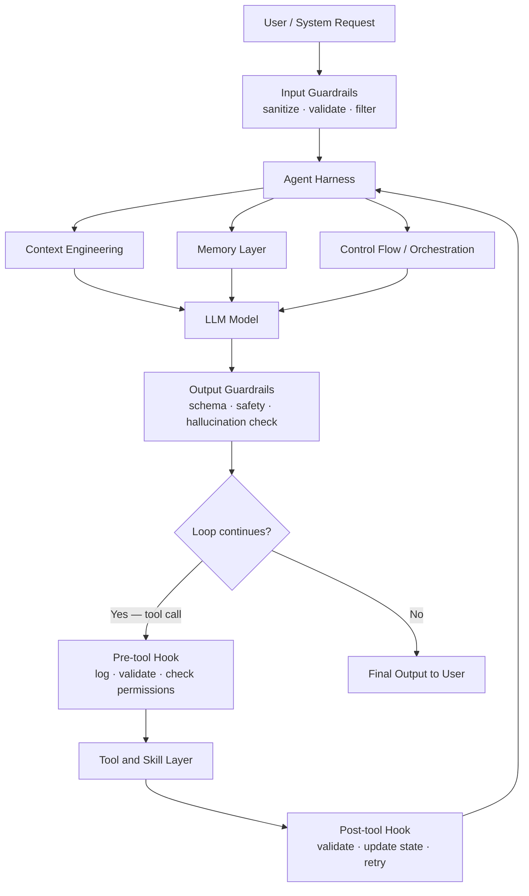
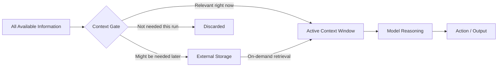
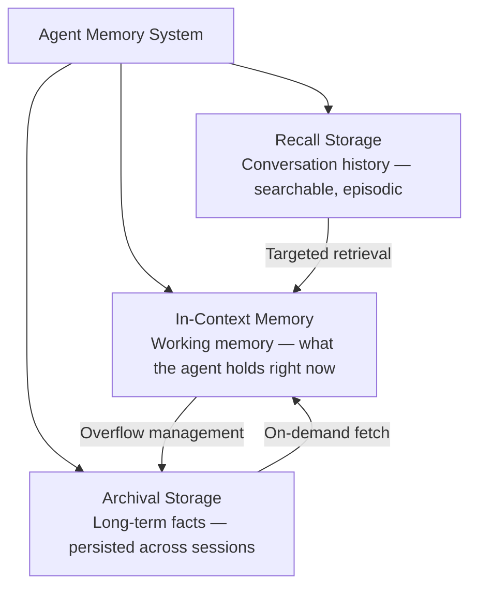
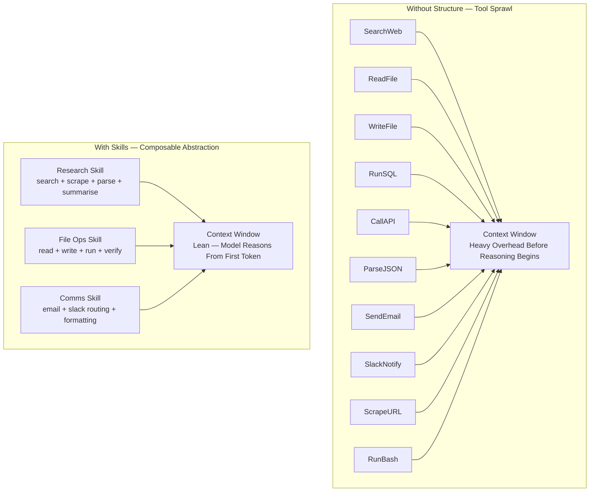
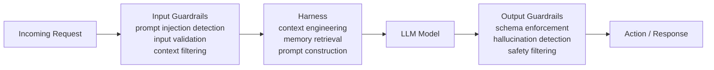

I was staring at my terminal one afternoon, watching [[Claude Code]] work through a bug in a Python service.

It called a tool to read the file. Then it analyzed the error. Then it searched the codebase for similar patterns. Then it wrote the fix, ran the test, observed the output, adjusted. No model switch. Same model the whole time.

But the output was sharper than anything I'd gotten from a raw API call to a bigger, more expensive model.

I sat back and thought: what exactly am I watching here?

---

### The belief that costs money

When I started working seriously with LLMs, I believed what most people building with them believe: the model is the product. Better model, better output. The infrastructure around it is temporary scaffolding — necessary now, irrelevant when the next frontier model arrives.

That belief is why teams spend weeks debating GPT-5 vs Claude Sonnet vs Gemini, then slap the winning model into a vague system prompt and call it an agent. Each generation handles more, needs less hand-holding. The logic feels airtight.

Here's what it costs in practice. Teams spend significant money on the most expensive model available, running it with bloated prompts, too many tools, no memory between sessions, no way to observe what it's doing. The output is mediocre. They upgrade. It improves marginally. They upgrade again.

The model was rarely the problem. But upgrading it was the first thing everyone reached for.

Buying a bigger model and praying the agent performs is not an engineering strategy. It's a reflex. And it's expensive.

---

### Half a million lines

[[Claude Code]] runs on 512,000 lines of TypeScript. [1]

Not model weights. Not training infrastructure. The full application — tools, memory management, context control, multi-agent coordination, IDE bridging. [[Anthropic]], the company building the frontier model, needs half a million lines of infrastructure *around* it. They are not waiting for the model to absorb the harness. They are building the harness.

The model is a component. The harness is the architecture.

An agent harness is everything the model doesn't manage itself. It decides what the model sees (context), what it remembers (memory), what it can act on (tools and skills), and when to stop (control flow). Guardrails enforce boundaries at the edges. Hooks instrument every tool call in between.

Every performance or safety problem in an agentic system I've debugged traces back to one of these six layers. Not the model.

When an agent behaves unexpectedly, the first question isn't "is this model good enough?" It's: which harness layer broke?

---

### Why the model was always drowning

I read [[Manus]]'s published post on context engineering in 2025. [3] They had written down something I had been doing by instinct without being able to name it: context is a resource to be managed, not a dump to be filled.

The naive version — give the model everything it might need and let it sort — is how most early [[RAG]] (Retrieval Augmented Generation: feeding the model relevant documents at query time) systems worked. Fill the window and hope. Manus's approach was cleaner: rather than keeping tool outputs in message history, dump them to the filesystem and pass the agent only a pointer. The context stays lean. The information is still reachable when needed.

A model with tight, well-sequenced context reasons better than the same model drowning in everything at once. I've seen it consistently: agents with elaborate tool setups performing worse than agents with a clear system prompt and minimal instructions.

Context engineering also saves tokens. Saved tokens save money. In production, running thousands of agent calls, this compounds fast. The engineer treating context as a first-class concern is also the engineer whose agent runs cheapest at scale.

---

### The agent that forgets everything each morning

The [[MemGPT]] paper reframed how I think about agent memory. [4] The typical design is binary: everything the agent knows is either in the current context window, or in an external database it queries. MemGPT proposed a three-tier structure drawn from how operating systems manage hierarchical memory.

In-context memory is fast but constrained by the window. Archival storage persists facts across sessions — the agent remembers what it learned yesterday. Recall storage lets the agent search its own history, treating past conversations as evidence for current reasoning.

Designing those transitions explicitly separates agents that compound knowledge over time from agents that restart from scratch every run.

The memory implementation I keep coming back to is actually the most low-tech one: a bash tool with filesystem access. A model that can read files, write files, run commands, and observe results handles most agentic tasks without a dedicated memory manager. The filesystem is the memory. The bash tool is the interface. It manages context exactly the way Manus does, and provides persistence across runs without extra infrastructure. Some of my most efficient agents are built this way.

---

### More capability, worse performance

At [[Hypatos]], I was building document processing agents with the [[Agno]] framework. [2] I was running a smaller model — not the flagship — but with tools designed around the actual task, structured memory across sessions, and a system prompt that did real work. The output was better than what the team had been getting from naive calls to a model two tiers above it.

Then it happened again on a different task. And again.

Every tool definition occupies context. Ten tools means significant overhead before the agent has done anything — the model reads all tool descriptions at the start of every call. Add enough tools and you're spending context budget before the first reasoning step begins. Red Hat's analysis puts it plainly: "feeding all available tools into a single prompt overwhelms the model and degrades its performance." Intelligent tool selection can triple tool invocation accuracy while halving prompt length. [5]

Skills solve this. A skill is a directory with a SKILL.md file: instructions, scripts, and resources the agent discovers and loads dynamically. [6] Instead of ten raw tool descriptions, the model sees three skills with clear purposes. Less overhead. Better reasoning. I now group tools by what I'm trying to accomplish, not by what each function does.

One more thing that often gets ignored: sequential tool calls are one of the biggest hidden latency sources in an agentic run. Where calls are independent, run them in parallel. This alone cuts run time significantly on multi-step tasks.

---

### The harness watching itself

The layers above — context, memory, tools — make the agent perform. These two make it safe enough to actually run.

Guardrails sit at the boundaries. Input guardrails intercept before the model sees anything — sanitizing input, detecting prompt injection, validating what's arriving. Output guardrails intercept after the model responds but before the action lands. They check format, catch hallucinations, filter unsafe content, enforce schema. [8]

In my experience, output guardrails matter more in production. A well-designed system prompt does a lot of input filtering already. Model output is where surprises live — wrong format, hallucinated values, confident answers the model shouldn't be giving. Output guardrails are the last line before that reaches the user or another system.

Hooks are different. They don't guard the boundary — they instrument the interior. Pre-tool hooks fire before a tool call: log the intent, validate parameters, check permissions. Post-tool hooks fire after: validate the output, update agent state, handle errors, trigger retry logic.

Claude Code uses this hook pattern throughout its own execution loop — its implementation of the ReAct (reason-act-observe) cycle adds explicit pre-check and post-processing phases at every tool execution step. [1] [9] In practice: you can observe, modify, or block any action the agent wants to take, at the exact moment it wants to take it.

Without guardrails and hooks, you have an agent that works in demos and fails quietly in production. With them, you have a system that fails gracefully, surfaces unexpected behavior, and gives you enough observability to actually improve it over time.

---

### Where I'm less certain

The memory ownership argument — that closed harnesses trap your data — is real. [7] But enterprise agreements from [[Anthropic]], [[Azure OpenAI]], and similar providers include explicit no-training and no-storage clauses for customer data. The concern is legitimate. The solution is reading the contract, not just switching to an open harness.

What I think is non-negotiable in any setup: agent tracing. If you can't observe what your agent is doing at each step — which tools it called, what context it had, why it made each decision — you can't improve it. Tracing is how you find the harness failure before the user does.

Most use cases don't need multi-agent systems either. One orchestrator with clear tools, tight context, and well-designed skills handles more than people expect. Multi-agent adds coordination overhead, more failure points, harder tracing. It's the right answer for genuinely parallel workloads where no single agent can hold the full picture. It is not a general upgrade.

On model ceiling: I'm still figuring out at what point the model becomes the bottleneck regardless of harness quality. Some tasks clearly need more model — very long reasoning chains, novel inference, tasks that genuinely need broad world knowledge. But that ceiling is further out than I used to assume. The harness buys more runway than most people expect.

---

### The questions that actually matter

I don't evaluate agents by model size anymore. I look at the harness first.

Is the context tight, or is the agent getting everything and hoping? Are the tools grouped into skills, or sprawled into bloat? Are tool calls parallel where they can be? Are there guardrails on input and output? Are there hooks on tool calls, or is the agent a black box between request and result?

These questions tell me more about an agent's performance than which model is running under the hood.

Pick a decent model. Build the harness right. That order matters.

---

I'm still figuring out where this stops being true. But it's further out than I thought, sitting in my terminal that afternoon, watching the agent call its first tool.

---

### References

[1] Multiple sources confirmed the Claude Code source exposure on March 31, 2026, when a packaging error on npm included production source maps, recovering 512k+ lines of TypeScript comprising tools, orchestration, multi-agent coordination, and IDE bridging.
- Olson, R. (2026). *The Claude Code leak in four charts: half a million lines, three accidents, forty tools.* [randalolson.com](https://www.randalolson.com/2026/04/02/claude-code-leak-four-charts/)
- Superframeworks (2026). *Claude Code Source Code Leaked: What 512K Lines Reveal About the Best AI Coding Harness.* [superframeworks.com](https://superframeworks.com/articles/claude-code-source-code-leak)
- Paddo.dev (2026). *The Claude Code Leak: What the Harness Actually Looks Like.* [paddo.dev](https://paddo.dev/blog/claude-code-leak-harness-exposed/)

[2] Agno (formerly Phidata, rebranded January 2025) is an open-source Python framework for building, deploying, and managing AI agents at scale.
- Agno (2025). *Build, run, manage agentic software at scale.* [agno.com](https://www.agno.com/) · [github.com/agno-agi/agno](https://github.com/agno-agi/agno)

[3] Manus published their context engineering principles in 2025, including filesystem offloading, restorable compression, and KV-cache optimisation as core strategies.
- Manus (2025). *Context Engineering for AI Agents: Lessons from Building Manus.* [manus.im](https://manus.im/blog/Context-Engineering-for-AI-Agents-Lessons-from-Building-Manus)

[4] The MemGPT paper introduced a three-tier virtual context management system for LLMs inspired by OS hierarchical memory. Letta is the open-source agent framework that evolved from this research.
- Packer, C., Wooders, S., Lin, K., Fang, V., Patil, S. G., & Gonzalez, J. E. (2023). *MemGPT: Towards LLMs as Operating Systems.* arXiv:2310.08560. [arxiv.org](https://arxiv.org/abs/2310.08560)
- Letta (2024). *Agent Memory: How to Build Agents that Learn and Remember.* [letta.com](https://www.letta.com/blog/agent-memory)

[5] Tool proliferation degrades LLM agent performance. Research shows intelligent tool retrieval can triple tool invocation accuracy while reducing prompt length by half.
- Red Hat Emerging Technologies (2025). *Tool RAG: The Next Breakthrough in Scalable AI Agents.* [next.redhat.com](https://next.redhat.com/2025/11/26/tool-rag-the-next-breakthrough-in-scalable-ai-agents/)
- arXiv (2025). *Solving Context Window Overflow in AI Agents.* [arxiv.org](https://arxiv.org/html/2511.22729v1)

[6] Agent Skills (SKILL.md) are Anthropic's composable, installable agent behaviour standard. Released as open standard in December 2025, adopted by multiple agent frameworks.
- Anthropic (2025). *Agent Skills — Claude API Docs.* [platform.claude.com](https://platform.claude.com/docs/en/agents-and-tools/agent-skills/overview)
- Anthropic Engineering (2025). *Equipping agents for the real world with Agent Skills.* [anthropic.com](https://www.anthropic.com/engineering/equipping-agents-for-the-real-world-with-agent-skills)

[7] The memory ownership and vendor lock-in argument comes from the LangChain team's analysis of harness economics.
- LangChain / Wooders, S., Trivedy, V., Runkle, S., Campos, N. (2026). *Your Harness, Your Memory.* [blog.langchain.com](https://blog.langchain.com/your-harness-your-memory/)

[8] LLM guardrails operate at three levels: input (before the model sees a request), output (after the model responds), and interaction-level (limiting agentic actions). Output guardrails catch hallucinations, enforce schema, and filter unsafe content before it reaches users or downstream systems.
- Datadog (2025). *LLM guardrails: Best practices for deploying LLM apps securely.* [datadoghq.com](https://www.datadoghq.com/blog/llm-guardrails-best-practices/)
- Guardrails AI (2025). *Guardrails Index — benchmarking 24 guardrails across 6 categories.* [guardrailsai.com](https://guardrailsai.com/blog/nemoguardrails-integration)
- orq.ai (2025). *Mastering LLM Guardrails: Complete 2025 Guide.* [orq.ai](https://orq.ai/blog/llm-guardrails)

[9] Pre/post tool call hooks are a core harness pattern. Claude Code's implementation of the ReAct loop (reason-act-observe) adds explicit pre-check and post-processing phases at every tool execution step. Its safety system uses hooks for dangerous command detection, approval workflows, and doom loop prevention.
- Gupta, A. (2026). *2025 Was Agents. 2026 Is Agent Harnesses.* [medium.com](https://aakashgupta.medium.com/2025-was-agents-2026-is-agent-harnesses-heres-why-that-changes-everything-073e9877655e)
- arXiv (2026). *Building AI Coding Agents for the Terminal: Scaffolding, Harness, Context Engineering, and Lessons Learned.* [arxiv.org](https://arxiv.org/html/2603.05344v1)
- Schmid, P. (2026). *The importance of Agent Harness in 2026.* [philschmid.de](https://www.philschmid.de/agent-harness-2026)
