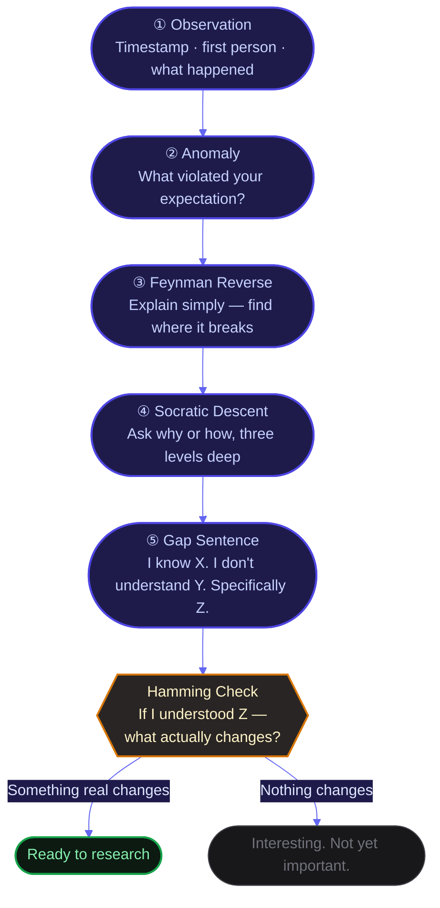

You notice something. A short walk completely shifts your mood when you expected to feel worse. A conversation goes sideways for no reason you can name. You read something and it sticks in a way that a whole week of meetings never did.

You write it down. You tell yourself you want to understand it. And then — nothing. The moment passes. The question dissolves before anything can be done with it.

That is not a curiosity problem. That is a question formation problem.

---

### The Problem Isn't Your Vocabulary

Most people assume that asking better questions is a vocabulary problem. Frame it more precisely. Use the right words. Sound like a scientist. Ask more questions in general. Be more curious, in a broader way.

That is the wrong frame entirely.

More questions without direction produce a pile of vague wonderings. Interesting for a moment. Inert the next. And precision in phrasing doesn't help if you haven't identified what you actually want to know. You can spend a long time polishing a question that was never sharp to begin with.

The problem isn't how you phrase the question. The problem is whether the question names something you can actually see.

---

### Why Some Questions Pull and Others Don't

In 1994, psychologist George Loewenstein published a theory that changed how researchers think about curiosity. The [[Information Gap Theory]] is this: curiosity does not arise from ignorance. It arises from partial knowledge that reveals a specific absence.

Complete ignorance produces nothing. You cannot be curious about something you do not know exists. But partial knowledge — knowing enough to see what you do not know — creates a pull that feels almost physical. You can't ignore it. You need to close it.

A good question is one where you can state the gap precisely. "I know X happened. I know Y is my current explanation. But Y does not account for Z, and I want to understand Z."

The gap has to be visible. Visible gaps pull. Invisible gaps don't.

This is why the question "I want to understand mood" goes nowhere. There is no gap you can see. It is open sky. Whereas "I felt significantly better after three minutes of movement in a context where I expected to feel worse — and I have no explanation for the speed of that shift" has a specific edge you can point to. A gap you can actually see.

---

### The Irritation of Doubt

The philosopher [[Charles Sanders Peirce]] called the first moment of a real question the *irritation of doubt* — a specific mismatch between what you experienced and what you expected. Not neutral observation. A violation. Something that should not have happened, or did not feel the way it should.

He called the reasoning that follows abductive reasoning (a best-guess explanation made in the face of a surprising fact) — not deduction (logic working forward from rules), not induction (pattern extracted from many examples), but the earlier, stranger thing: you experienced something surprising, so your mind offers a plausible guess about why. That guess becomes the question.

Most observations we make pass through without triggering anything. Expected. Filed. Gone. It is only the observations that violate our expectations that have the raw material for a real question. That violation — "this should not have happened" or "I did not expect to feel this" — is where every good question starts.

---

### Five Steps from Observation to Question

This is the reusable sequence. It works whether you are trying to understand something in your own life, in your work, or in a domain you are trying to learn.

**Step 1: Name the specific observation.**
Timestamp it. First person. What actually happened. No generalising yet. "On this day, in this context, while in this state, I observed this."

**Step 2: Name the anomaly.**
What violated your expectation? Why should this not have happened? This is the most important step. The anomaly is not the observation itself — it is the mismatch between the observation and what you assumed would happen. If there is no mismatch, there is probably no strong question yet.

**Step 3: Feynman Reverse.**
Try to explain your current assumption about why the thing happened — in plain language, the way you would to someone who knows nothing about the subject. The first word or phrase you cannot simplify further without waving your hand ("because of hormones", "because of psychology", "because it just does") — that is exactly where the question lives. [[Richard Feynman]] built his entire learning method on this direction. The reverse works the same way.

**Step 4: Socratic Descent.**
Take the first answer your mind offers and treat it as a new question. Ask *why* or *how* past it. Do this three levels deep. You are looking for one of two things: something verifiable by research, or a claim that "everyone just knows" — because that second type is almost always where the genuinely interesting gaps are.

**Step 5: Write the gap sentence.**
Loewenstein's theory implies a test: if you cannot state the gap precisely, the question is not yet ready. The form that works: *"I know [X — the confirmed observation]. I don't understand [Y — the mechanism or pattern]. Specifically [Z — the precise, bounded gap]."*

Z should be narrow enough that a single research paper could, in principle, answer it. If it is still too broad, split it into two questions and pick one.

Before you start researching, one more check. Ask: if I actually understood Z, what would change? What decision would I make differently? What pattern in my life or work would shift? [[Richard Hamming]], a mathematician who spent thirty years at [[Bell Labs]] before moving to the Naval Postgraduate School, built a habit of asking colleagues across fields: "What are the important problems in your field — and why aren't you working on them?" The same filter applies here. If understanding Z changes nothing real, the question is interesting but not yet important. That is worth knowing before you spend three hours researching it.

---

### Where This Gets Harder

This protocol works cleanly for mechanism questions — "how does X produce Y?" and intervention questions — "what can I do to produce X?" It works less cleanly for relational and emotional questions, where the anomaly is harder to name and the mechanism is less separable from the experience of it.

I also don't know whether this protocol can be run in under two minutes. The way it is laid out, each step takes real thought. There is probably a faster version — a single question you could ask yourself before any observation slips away. I haven't found it yet.

---

The quality of your understanding will be exactly as good as the precision of your gap.

Most people stop at "I want to understand this." That is not a question. It is the feeling that precedes one. The question begins the moment you can name specifically what you do not know — and why, given what you do know, that absence matters.

What I'm still curious about: whether this changes how people write. Because the same protocol — name what you know, name what you don't, name precisely where they meet — might be the structure underneath every good piece of writing, not just every good research question.

---

*Sources: Loewenstein, G. (1994). The psychology of curiosity: A review and reinterpretation. Psychological Bulletin, 116(1), 75–98. https://doi.org/10.1037/0033-2909.116.1.75 | Peirce, C.S. (1877). The Fixation of Belief. Popular Science Monthly, 12, 1–15. | Hamming, R.W. (1986). You and Your Research. Talk delivered at Bell Communications Research Colloquia Series, Bellcore, March 7, 1986. Transcript: https://www.cs.virginia.edu/~robins/YouAndYourResearch.html*
